## 1. Fundamentos de Algoritmos

### ¿Qué es un Algoritmo?

Un algoritmo es un conjunto finito y ordenado de pasos que resuelve un problema específico.

**Ejemplo paso a paso** - Algoritmo para preparar un sándwich:

1. Tomar dos rebanadas de pan
2. Colocar jamón sobre una rebanada
3. Colocar queso sobre el jamón
4. Colocar la segunda rebanada de pan encima
5. El sándwich está listo

### Complejidad Algorítmica Básica

Mide la eficiencia de un algoritmo en términos de tiempo y espacio.

**Ejemplo sencillo** - Análisis de un algoritmo que suma elementos:

```go
func suma(arr []int) int{
    total := 0
    for i :=0; i < len(arr); i++ {
        total += arr[i]
    }
    return total
}
```

Análisis:

1. La inicialización toma tiempo constante: O(1)
2. El bucle se ejecuta n veces (n = tamaño del arreglo)
3. Complejidad total: O(n) - crece linealmente con el tamaño de entrada

## 2. Algoritmos de Búsqueda Simples

### Búsqueda Lineal

El método más sencillo: recorre el arreglo elemento por elemento.

**Ejemplo paso a paso:**

Buscando el valor 6 en [4, 2, 7, 1, 6, 9, 3]

1. ¿4 = 6? No
2. ¿2 = 6? No
3. ¿7 = 6? No
4. ¿1 = 6? No
5. ¿6 = 6? Sí, ¡Encontrado en la posición 4!

### Búsqueda Binaria

Más eficiente pero requiere un arreglo ordenado.

**Ejemplo paso a paso:**

Buscando el valor 7 en [1, 2, 3, 4, 5, 6, 7, 8, 9]

1. Mitad: 5 (índice 4)
2. 7 > 5, por lo que buscamos en la mitad derecha: [6, 7, 8, 9]
3. Mitad: 7 (índice 6 del arreglo original)
4. 7 = 7, ¡Encontrado!

## 3. Algoritmos de Ordenamiento Básicos

### Ordenamiento por Inserción

Simula cómo ordenamos cartas en nuestra mano.

**Ejemplo paso a paso:**

Ordenando [5, 2, 4, 6, 1, 3]

1. [5] está ordenado
2. Insertamos 2: [2, 5]
3. Insertamos 4: [2, 4, 5]
4. Insertamos 6: [2, 4, 5, 6]
5. Insertamos 1: [1, 2, 4, 5, 6]
6. Insertamos 3: [1, 2, 3, 4, 5, 6]

### Ordenamiento por Selección

Busca repetidamente el elemento mínimo y lo coloca al principio.

**Ejemplo paso a paso:**

Ordenando [64, 25, 12, 22, 11]

1. Mínimo = 11, intercambiamos con 64: [11, 25, 12, 22, 64]
2. Mínimo = 12, intercambiamos con 25: [11, 12, 25, 22, 64]
3. Mínimo = 22, intercambiamos con 25: [11, 12, 22, 25, 64]
4. Mínimo = 25, ya está en su lugar: [11, 12, 22, 25, 64]
5. Resultado: [11, 12, 22, 25, 64]

### Ordenamiento Burbuja

Compara pares adyacentes y los intercambia si están en orden incorrecto.

**Ejemplo paso a paso:**

Ordenando [5, 1, 4, 2, 8]

Primera pasada:

1. [5, 1, 4, 2, 8] → [1, 5, 4, 2, 8]
2. [1, 5, 4, 2, 8] → [1, 4, 5, 2, 8]
3. [1, 4, 5, 2, 8] → [1, 4, 2, 5, 8]
4. [1, 4, 2, 5, 8] (no hay cambio)

Segunda pasada:

1. [1, 4, 2, 5, 8] → [1, 4, 2, 5, 8]
2. [1, 4, 2, 5, 8] → [1, 2, 4, 5, 8]
3. [1, 2, 4, 5, 8] (no hay cambios)

Tercera pasada: sin cambios, terminamos con [1, 2, 4, 5, 8]

## 4. Estructuras de Datos Básicas

### Arreglos y Matrices

Colecciones indexadas de elementos del mismo tipo.

**Ejemplo paso a paso** - Operaciones con arreglos:

* Crear un arreglo: `arr = [10, 20, 30, 40, 50]`

```go
arr := []int{10, 20, 30, 40, 50}
```

* Acceder al elemento en posición 2: `arr[2]` = 30

```go
fmt.Println(arr[2])
```

* Modificar un elemento: `arr[1] = 25` → [10, 25, 30, 40, 50]

```go
arr[1] = 25
```

* Recorrer el arreglo:

```go
for i := 0; i < len(arr); i++ {
    fmt.Println(arr[i])
}

```

### Listas Enlazadas

Secuencia de nodos donde cada uno apunta al siguiente.

**Ejemplo paso a paso** - Creación de una lista enlazada simple:

1. Creamos el nodo con valor 10 (cabeza)
2. Creamos el nodo con valor 20 y lo conectamos a la cabeza
3. Creamos el nodo con valor 30 y lo conectamos al nodo anterior
4. Resultado: 10 → 20 → 30

## 5. Algoritmos Recursivos

Un algoritmo que se llama a sí mismo con un caso base para terminar.

**Ejemplo paso a paso** - Cálculo del factorial:

Factorial(4):

1. ¿4 = 0? No, entonces 4 * Factorial(3)
2. ¿3 = 0? No, entonces 3 * Factorial(2)
3. ¿2 = 0? No, entonces 2 * Factorial(1)
4. ¿1 = 0? No, entonces 1 * Factorial(0)
5. ¿0 = 0? Sí, devuelve 1
6. Subiendo: 1 * 1 = 1
7. Subiendo: 2 * 1 = 2
8. Subiendo: 3 * 2 = 6
9. Subiendo: 4 * 6 = 24
10. Resultado: Factorial(4) = 24

**Ejemplo paso a paso** - Secuencia de Fibonacci:

Fibonacci(5):

1. ¿5 <= 1? No
2. Calculamos Fibonacci(4) y Fibonacci(3)
        - Para Fibonacci(4):
        - ¿4 <= 1? No
        - Calculamos Fibonacci(3) y Fibonacci(2)
        - (seguimos el proceso recursivo)
        - Para Fibonacci(3):
        - (similar al anterior)

3. Resultado: Fibonacci(5) = 5

## 6. Algoritmos de Ordenamiento Avanzados

### Mergesort

Divide el arreglo a la mitad, ordena cada mitad y luego las combina.

**Ejemplo paso a paso:**

Arreglo: [5, 2, 4, 7, 1, 3, 6]

1. Dividimos en mitades:
        - [5, 2, 4] y [7, 1, 3, 6]
2. Seguimos dividiendo:
        - [5], [2, 4] y [7], [1, 3, 6]
        - [5], [2], [4] y [7], [1], [3, 6]
        - [5], [2], [4] y [7], [1], [3], [6]
3. Combinamos en orden:
        - [2, 5], [4] y [1, 7], [3, 6]
        - [2, 4, 5] y [1, 3, 6, 7]
        - [1, 2, 3, 4, 5, 6, 7]

### Quicksort

Utiliza la estrategia "divide y vencerás" con un elemento pivote.

**Ejemplo paso a paso:**

Ordenando [7, 2, 1, 6, 8, 5, 3, 4]

1. Elegimos un pivote (usemos 4)
2. Colocamos elementos menores a la izquierda y mayores a la derecha
        - [2, 1, 3] 4 [7, 6, 8, 5]
3. Recursivamente ordenamos los subarreglos
        - Para [2, 1, 3]:
            - Pivote: 3
            - [1, 2] 3 []
            - [1, 2] ya está ordenado: [1, 2, 3]
        - Para [7, 6, 8, 5]:
            - Pivote: 5
            - [] 5 [7, 6, 8]
            - Para [7, 6, 8]:
            - Pivote: 8
            - [7, 6] 8 []
            - Para [7, 6]:
                - Pivote: 6
                - [] 6 [7]
                - Resultado: [6, 7]
            - Resultado: [6, 7, 8]
            - Resultado: [5, 6, 7, 8]
4. Resultado final: [1, 2, 3, 4, 5, 6, 7, 8]

## 7. Estructuras de Datos Avanzadas

### Pilas y Colas

Estructuras con reglas específicas de acceso.

**Ejemplo paso a paso** - Operaciones con una pila:

1. Creamos una pila vacía: `pila = []`
2. Insertamos (push) elementos:
        - `pila.push(5)` → [5]
        - `pila.push(8)` → [5, 8]
        - `pila.push(3)` → [5, 8, 3]
3. Eliminamos (pop) elementos:
        - `pila.pop()` → devuelve 3, pila = [5, 8]
        - `pila.pop()` → devuelve 8, pila = [5]

### Árboles Binarios

Cada nodo tiene como máximo dos hijos.

**Ejemplo paso a paso** - Construcción de un árbol binario de búsqueda:

Insertamos: 5, 3, 7, 2, 4, 6, 8

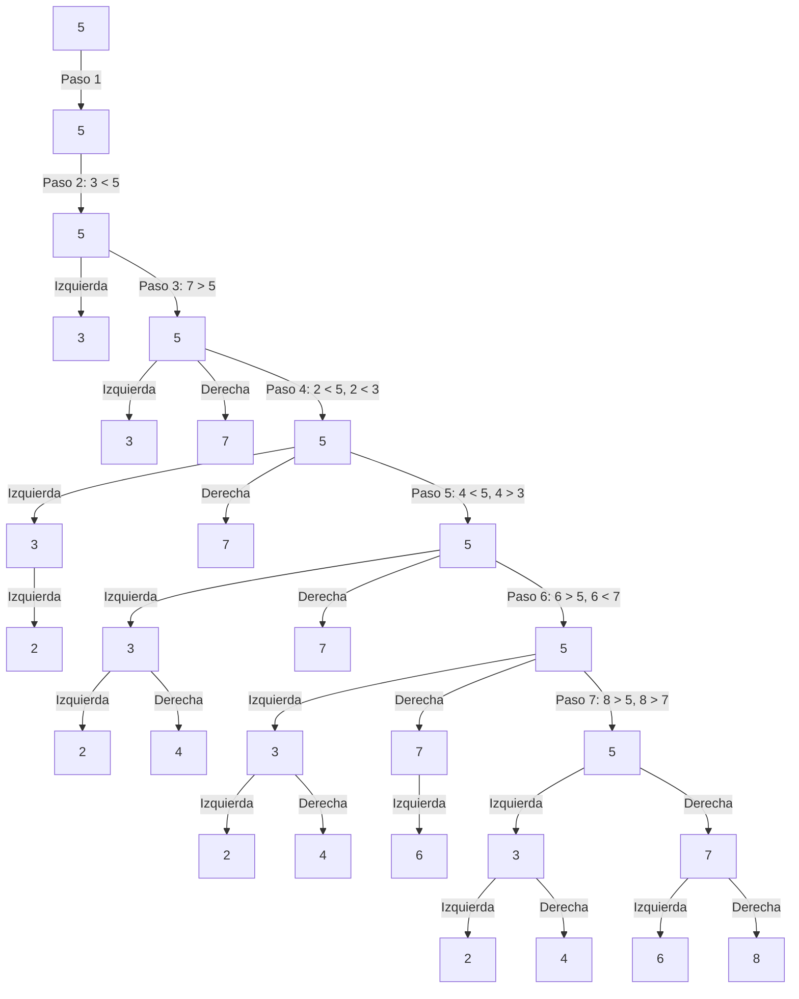

El diagrama muestra paso a paso cómo se va construyendo el árbol binario de búsqueda al insertar cada elemento. El árbol final se ve así:

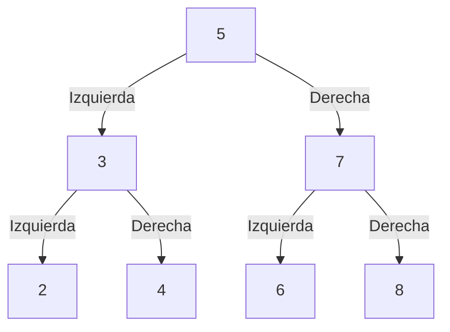

### Recorridos en Árboles Binarios

Existen tres formas principales de recorrer un árbol binario:

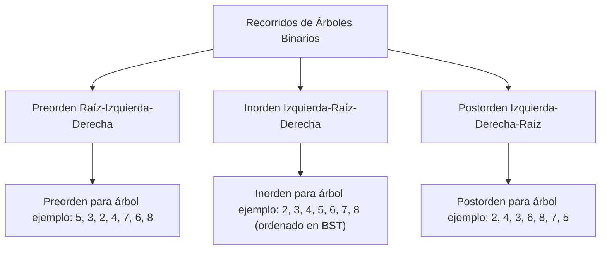

## 8. Técnicas de Diseño de Algoritmos - Divide y Vencerás con Árboles

El algoritmo Mergesort puede ser representado como un árbol de operaciones:

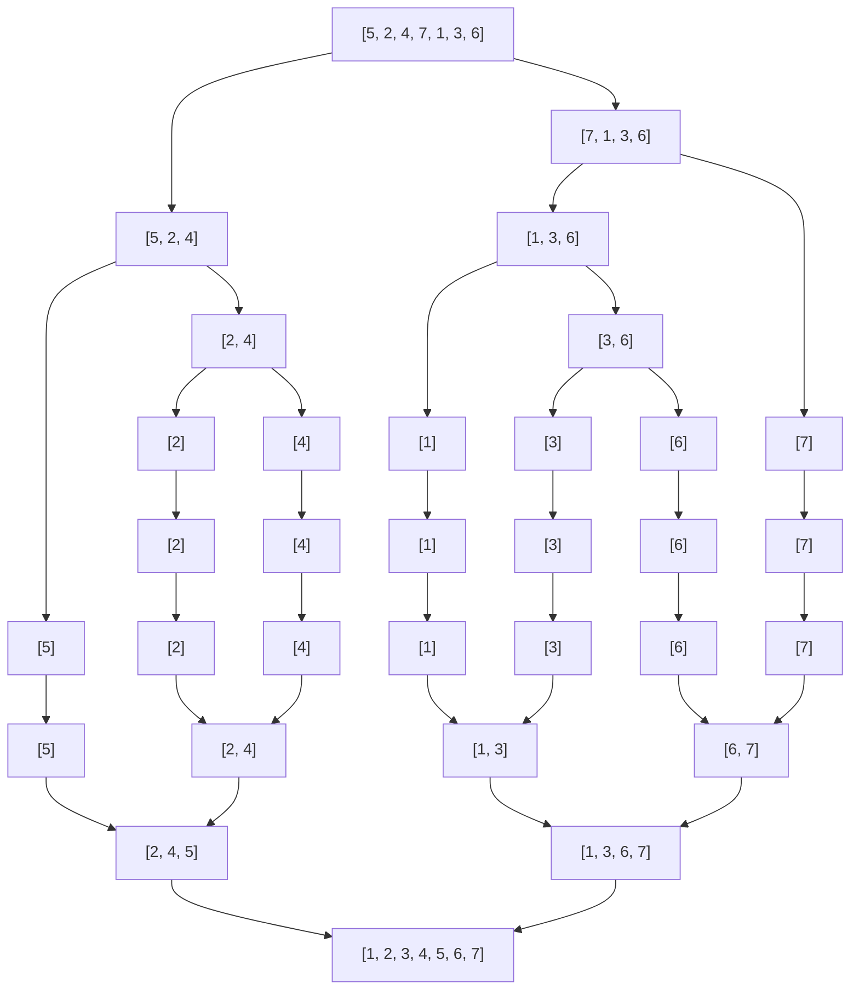

## 9. Algoritmos de Grafos

### Representación de Grafos

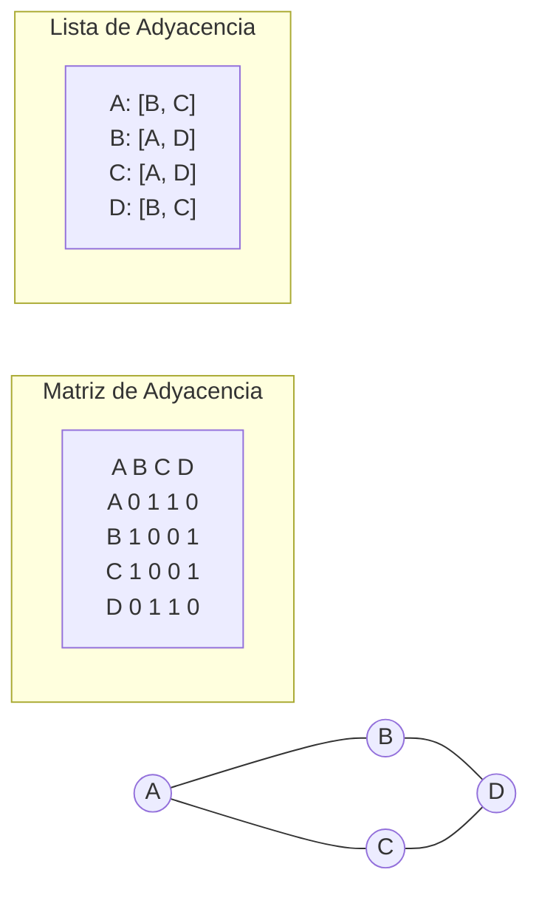

### BFS (Búsqueda en Anchura)

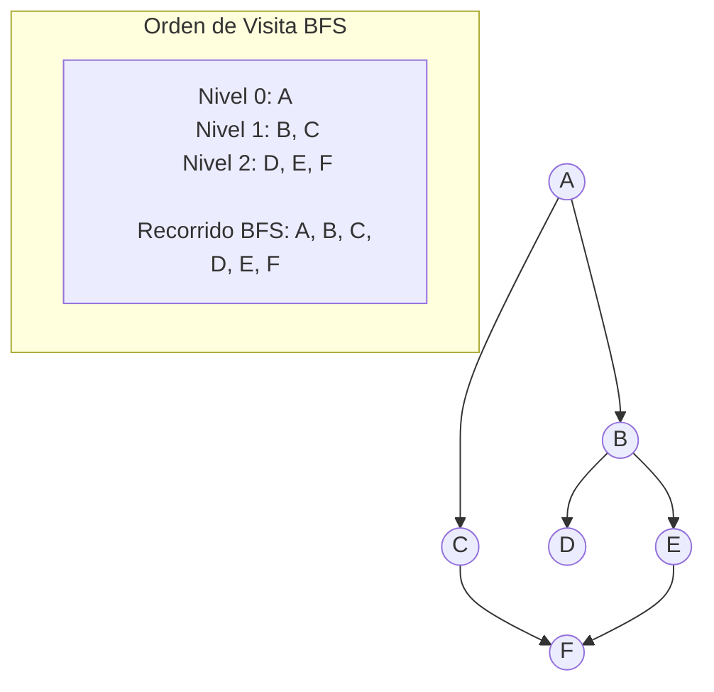

### DFS (Búsqueda en Profundidad)

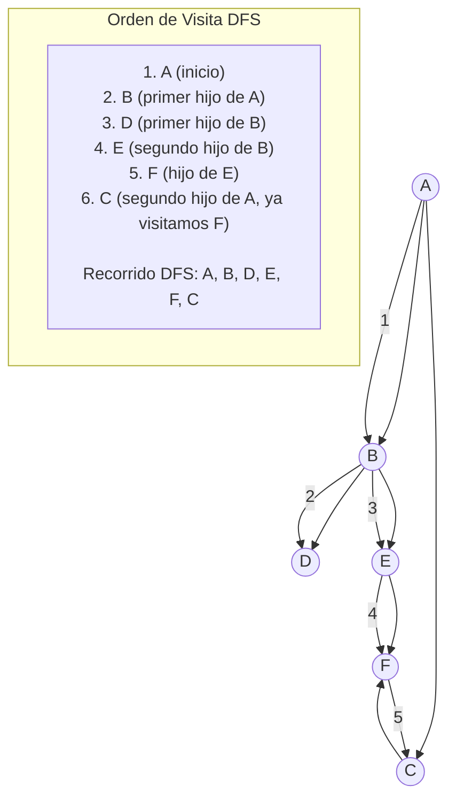

### Algoritmo de Dijkstra

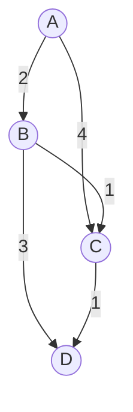

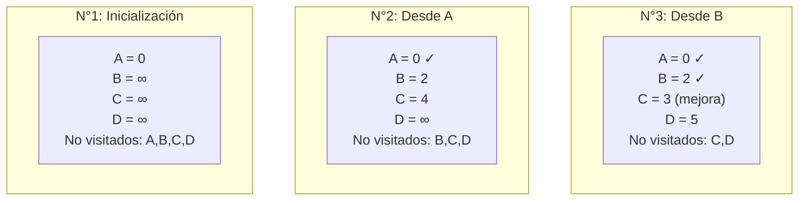

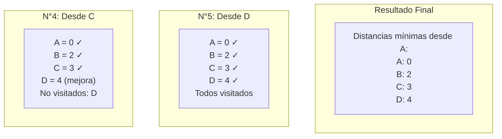

## Estructuras de Datos Jerárquicas Adicionales

### Árbol AVL (Árbol Binario Autobalanceado)

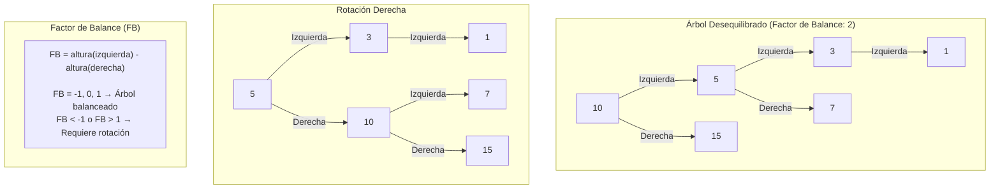

### Árbol B (para Bases de Datos)

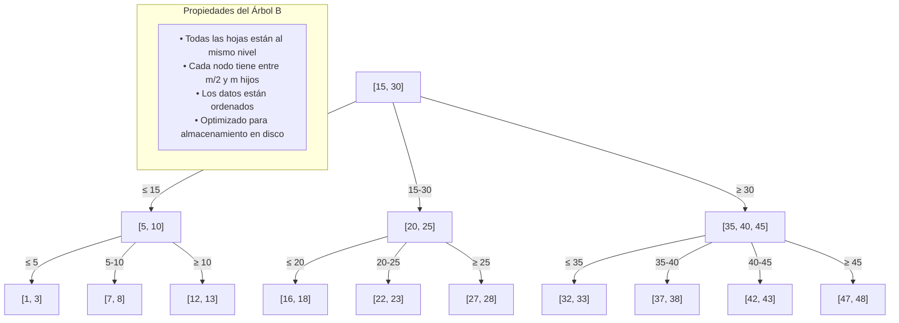

Los diagramas Mermaid muestran claramente la estructura y funcionamiento de los árboles y grafos, facilitando la comprensión de estos conceptos fundamentales en algoritmos.

Estos diagramas ilustran:

1. La construcción paso a paso de un árbol binario de búsqueda
2. El árbol binario final con todos los elementos
3. Los diferentes tipos de recorridos en árboles (preorden, inorden, postorden)
4. La visualización del algoritmo Mergesort como un árbol de operaciones
5. Las representaciones de grafos con matriz y lista de adyacencia
6. Los algoritmos BFS y DFS con el orden de visita de los nodos
7. El algoritmo de Dijkstra para encontrar el camino más corto
8. Los árboles AVL con sus rotaciones para mantener el balance
9. La estructura de un árbol B utilizado en bases de datos

Estos diagramas son una herramienta poderosa para comprender y visualizar los conceptos fundamentales de estructuras de datos, algoritmos y estructuras de datos avanzadas.
