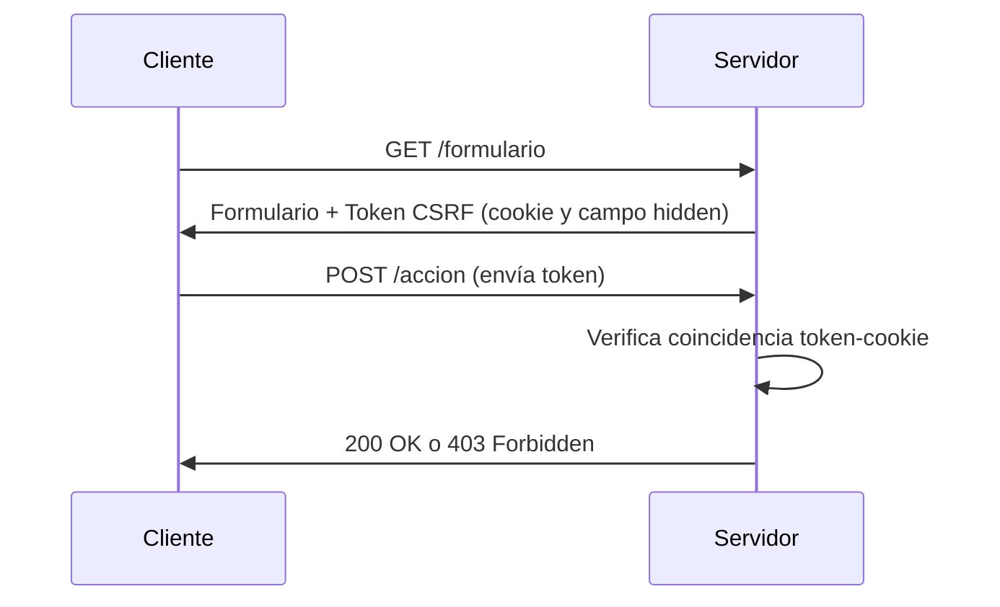

# Protección contra CSRF en Go

Imagina que CSRF (Cross-Site Request Forgery) es como un impostor que envía cartas falsas firmadas con tu nombre. Vamos a aprender a poner un "sello de seguridad" en cada solicitud para verificar que realmente eres tú quien la envía.

## ¿Qué es CSRF y por qué es peligroso?

Un ataque CSRF ocurre cuando un sitio web malicioso engaña al navegador para que realice acciones no deseadas en otro sitio donde el usuario está autenticado.

**Ejemplo real:**  
Si estás logueado en tu banco y visitas un sitio malicioso, este podría enviar una solicitud oculta para transferir dinero sin tu consentimiento.

## ¿Cómo funciona la protección CSRF?

El método más común usa:
1. **Token CSRF**: Un valor secreto único por sesión
2. **Cookie SameSite**: Restringe cómo se envían las cookies entre sitios
3. **Verificación de origen**: Compara el origen de la solicitud



## Implementación básica en Go

### 1. Middleware CSRF manual

```go
package middleware

import (
    "crypto/rand"
    "encoding/base64"
    "net/http"
)

// Generar token seguro
func generateToken() string {
    b := make([]byte, 32)
    rand.Read(b)
    return base64.StdEncoding.EncodeToString(b)
}

func CSRFProtect(next http.Handler) http.Handler {
    return http.HandlerFunc(func(w http.ResponseWriter, r *http.Request) {
        // Solo aplicar a métodos no-GET
        if r.Method != "GET" {
            // Obtener token de cookie y formulario
            cookieToken, _ := r.Cookie("csrf_token")
            formToken := r.FormValue("csrf_token")
            
            // Verificar coincidencia
            if cookieToken == nil || cookieToken.Value != formToken {
                http.Error(w, "Token CSRF inválido", http.StatusForbidden)
                return
            }
        }
        
        // Para GET: establecer nueva cookie CSRF
        token := generateToken()
        http.SetCookie(w, &http.Cookie{
            Name:     "csrf_token",
            Value:    token,
            HttpOnly: true,
            Secure:   true,
            SameSite: http.SameSiteStrictMode,
        })
        
        next.ServeHTTP(w, r)
    })
}
```

### 2. Uso en formularios HTML



```html
<!-- En tu template de formulario -->
<form action="/transfer" method="POST">
    <input type="hidden" name="csrf_token" value="{{.CSRFToken}}">
    <input type="text" name="amount">
    <button type="submit">Transferir</button>
</form>
```


## Configuración avanzada

### 1. Con gorilla/csrf (recomendado)

```go
package main

import (
    "github.com/gorilla/csrf"
    "github.com/gorilla/mux"
    "net/http"
)

func main() {
    r := mux.NewRouter()
    
    // Configurar protección CSRF
    csrfKey := []byte("32-byte-long-auth-key") // En producción usa crypto/rand
    csrfMiddleware := csrf.Protect(
        csrfKey,
        csrf.Secure(false), // Solo para desarrollo (true en producción)
        csrf.Path("/"),
        csrf.FieldName("csrf_token"),
    )
    
    // Aplicar middleware
    protectedRouter := csrfMiddleware(r)
    
    // Rutas
    r.HandleFunc("/form", ShowFormHandler).Methods("GET")
    r.HandleFunc("/process", ProcessFormHandler).Methods("POST")
    
    http.ListenAndServe(":8080", protectedRouter)
}

// Handler para mostrar formulario
func ShowFormHandler(w http.ResponseWriter, r *http.Request) {
    w.Header().Set("Content-Type", "text/html")
    fmt.Fprintf(w, `
        <form action="/process" method="POST">
            <input type="hidden" name="csrf_token" value="%s">
            <input type="text" name="data">
            <button type="submit">Enviar</button>
        </form>
    `, csrf.Token(r))
}
```

### 2. Con APIs REST y Single Page Apps

```go
// Middleware adaptado para APIs
func APICSRFProtect(next http.Handler) http.Handler {
    return http.HandlerFunc(func(w http.ResponseWriter, r *http.Request) {
        // Excluir endpoints de API pública
        if strings.HasPrefix(r.URL.Path, "/api/") {
            // Verificar encabezado personalizado
            if r.Header.Get("X-Requested-With") != "XMLHttpRequest" {
                http.Error(w, "Cabecera CSRF requerida", http.StatusForbidden)
                return
            }
            next.ServeHTTP(w, r)
            return
        }
        
        // Método tradicional para web
        cookieToken, _ := r.Cookie("csrf_token")
        headerToken := r.Header.Get("X-CSRF-Token")
        
        if r.Method != "GET" && (cookieToken == nil || cookieToken.Value != headerToken) {
            http.Error(w, "Invalid CSRF token", http.StatusForbidden)
            return
        }
        
        // Establecer nuevo token
        token := generateToken()
        w.Header().Set("X-CSRF-Token", token)
        http.SetCookie(w, &http.Cookie{
            Name:     "csrf_token",
            Value:    token,
            HttpOnly: true,
        })
        
        next.ServeHTTP(w, r)
    })
}
```

## Mejores prácticas de seguridad

1. **Tokens por sesión**: Genera un nuevo token al iniciar sesión
2. **SameSite Cookies**: Usa `SameSite=Lax` o `Strict`
3. **No almacenes tokens en localStorage**: Usa cookies HttpOnly
4. **Protege todos los métodos no-idempotentes**: POST, PUT, DELETE, PATCH
5. **Regenera tokens** después de su uso en flujos críticos

## Configuración recomendada para producción

```go
csrf.Protect(
    []byte("clave-secreta-de-32-bytes"), // Generada con crypto/rand
    csrf.Secure(true),                   // Solo HTTPS
    csrf.HttpOnly(true),
    csrf.SameSite(csrf.SameSiteStrictMode),
    csrf.Path("/"),                      // Alcance de la cookie
    csrf.MaxAge(3600),                   // 1 hora de vida
    csrf.ErrorHandler(http.HandlerFunc(func(w http.ResponseWriter, r *http.Request) {
        http.Error(w, "Solicitud CSRF rechazada", http.StatusForbidden)
    })),
)
```

## Solución de problemas comunes

### 1. Error: "CSRF token invalid"
- **Causas**:
  - Cookie no se está enviando
  - Token no coincide entre formulario y cookie
  - Cookie configurada con dominio/path incorrecto
- **Solución**:
  ```go
  // Verifica la configuración de la cookie
  http.SetCookie(w, &http.Cookie{
      Name:     "csrf_token",
      Value:    token,
      Domain:   "tudominio.com",
      Path:     "/",
      Secure:   true,
      HttpOnly: true,
      SameSite: http.SameSiteLaxMode,
  })
  ```

### 2. Problemas con Single Page Apps
- **Solución**: Usa encabezados personalizados:
  ```go
  func APICSrfMiddleware(next http.Handler) http.Handler {
      return http.HandlerFunc(func(w http.ResponseWriter, r *http.Request) {
          if r.Header.Get("X-Requested-With") == "XMLHttpRequest" {
              next.ServeHTTP(w, r)
              return
          }
          // Lógica CSRF tradicional...
      })
  }
  ```

## Pruebas de protección CSRF

### 1. Prueba manual con cURL
```bash
# Solicitud sin token (debería fallar)
curl -X POST http://tuservidor.com/transfer \
  -H "Content-Type: application/x-www-form-urlencoded" \
  -d "amount=1000"

# Solicitud con token válido
curl -X POST http://tuservidor.com/transfer \
  -H "Content-Type: application/x-www-form-urlencoded" \
  -H "Cookie: csrf_token=token_valido" \
  -d "amount=1000&csrf_token=token_valido"
```

### 2. Prueba automatizada con Go
```go
func TestCSRFProtection(t *testing.T) {
    ts := httptest.NewServer(CSRFMiddleware(app))
    defer ts.Close()

    // Test 1: Solicitud GET establece cookie
    resp, _ := http.Get(ts.URL)
    cookie := resp.Cookies()[0]

    // Test 2: POST sin token debe fallar
    resp, _ = http.Post(ts.URL, "text/plain", nil)
    if resp.StatusCode != http.StatusForbidden {
        t.Error("CSRF no protege solicitudes sin token")
    }

    // Test 3: POST con token correcto
    req, _ := http.NewRequest("POST", ts.URL, nil)
    req.AddCookie(cookie)
    req.Form.Add("csrf_token", cookie.Value)
    resp, _ = http.DefaultClient.Do(req)
    if resp.StatusCode != http.StatusOK {
        t.Error("CSRF bloquea solicitudes válidas")
    }
}
```

## Alternativas avanzadas

### 1. Doble envío de cookies
```go
func DoubleSubmitCookie(next http.Handler) http.Handler {
    return http.HandlerFunc(func(w http.ResponseWriter, r *http.Request) {
        if r.Method != "GET" {
            cookie, _ := r.Cookie("csrf_cookie")
            header := r.Header.Get("X-CSRF-Header")
            
            if cookie == nil || cookie.Value != header {
                http.Error(w, "Invalid CSRF token", http.StatusForbidden)
                return
            }
        }
        
        token := generateToken()
        http.SetCookie(w, &http.Cookie{
            Name:  "csrf_cookie",
            Value: token,
        })
        w.Header().Set("X-CSRF-Header", token)
        next.ServeHTTP(w, r)
    })
}
```

### 2. Encrypted Token Pattern
```go
func EncryptedTokenMiddleware(next http.Handler) http.Handler {
    return http.HandlerFunc(func(w http.ResponseWriter, r *http.Request) {
        if r.Method != "GET" {
            encryptedToken := r.FormValue("csrf_token")
            // Decrypt and validate: userID + timestamp
            isValid := validateEncryptedToken(encryptedToken)
            if !isValid {
                http.Error(w, "Invalid CSRF token", http.StatusForbidden)
                return
            }
        }
        
        // Generar nuevo token para la respuesta
        newToken := generateEncryptedToken(currentUserID)
        w.Header().Set("X-CSRF-Token", newToken)
        next.ServeHTTP(w, r)
    })
}
```

## Integración con frameworks web

### 1. Con Echo
```go
e := echo.New()
e.Use(middleware.CSRFWithConfig(middleware.CSRFConfig{
    TokenLookup: "header:X-CSRF-Token",
    CookieName:  "csrf",
    CookiePath:  "/",
}))
```

### 2. Con Gin
```go
func CsrfMiddleware() gin.HandlerFunc {
    return func(c *gin.Context) {
        token := c.GetHeader("X-CSRF-Token")
        if c.Request.Method != "GET" && token != getTokenFromSession(c) {
            c.AbortWithStatusJSON(http.StatusForbidden, gin.H{"error": "CSRF token invalid"})
            return
        }
        c.Set("csrf_token", generateNewToken())
        c.Next()
    }
}
```

## Conclusión

La protección CSRF es esencial para cualquier aplicación web. En Go puedes implementarla:

1. **Manualmente** para entender los conceptos
2. **Usando middlewares** como gorilla/csrf para producción
3. **Adaptando la solución** a tu arquitectura (SPA, tradicional, microservicios)

Recuerda:
- Nunca confíes solo en el frontend para seguridad
- Combina CSRF con otras medidas como SameSite cookies
- Prueba regularmente tus defensas

Con esta implementación tendrás una sólida protección contra ataques CSRF en tus aplicaciones Go.
