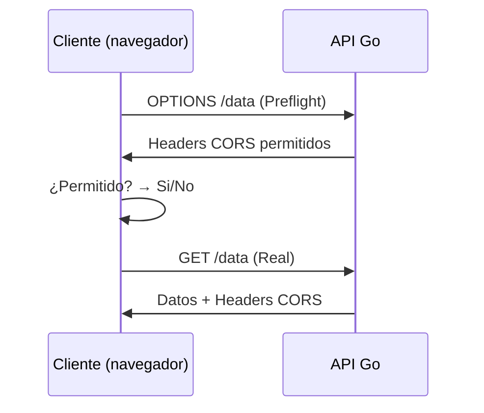

# CORS en APIs con Go: Guía Completa

Imagina que tu API es un club exclusivo y CORS es el portero que decide quién puede entrar. Vamos a aprender a configurar este "portero" correctamente para mantener segura tu API mientras permitas el acceso a tus aplicaciones web.

## ¿Qué es CORS y por qué es importante?

CORS (Cross-Origin Resource Sharing) es un mecanismo de seguridad del navegador que controla cómo interactúan recursos de diferentes orígenes. Funciona mediante **headers HTTP** especiales.

**Problema que resuelve:**  
Los navegadores bloquean por defecto solicitudes AJAX entre dominios diferentes (misma política de origen/Same-Origin Policy).

**Ejemplo real:**  
Si tu frontend en `https://tuaplicacion.com` intenta llamar a tu API en `https://api.tudominio.com`, el navegador bloqueará la solicitud sin CORS.

## Headers CORS esenciales

| Header | Ejemplo | Propósito |
|--------|---------|-----------|
| `Access-Control-Allow-Origin` | `https://tuaplicacion.com` | Especifica qué dominios pueden acceder |
| `Access-Control-Allow-Methods` | `GET, POST, PUT` | Métodos HTTP permitidos |
| `Access-Control-Allow-Headers` | `Content-Type, Authorization` | Headers que puede enviar el cliente |
| `Access-Control-Allow-Credentials` | `true` | Permite cookies/credenciales |
| `Access-Control-Max-Age` | `3600` | Cachear configuración CORS (segundos) |

## Implementación básica en Go

### 1. Middleware CORS manual

```go
package middleware

import "net/http"

func EnableCORS(next http.Handler) http.Handler {
    return http.HandlerFunc(func(w http.ResponseWriter, r *http.Request) {
        // 1. Configurar headers CORS
        w.Header().Set("Access-Control-Allow-Origin", "https://tuaplicacion.com")
        w.Header().Set("Access-Control-Allow-Methods", "GET, POST, OPTIONS, PUT, DELETE")
        w.Header().Set("Access-Control-Allow-Headers", "Content-Type, Authorization")
        w.Header().Set("Access-Control-Allow-Credentials", "true")
        w.Header().Set("Access-Control-Max-Age", "3600")

        // 2. Manejar preflight OPTIONS
        if r.Method == "OPTIONS" {
            w.WriteHeader(http.StatusOK)
            return
        }

        // 3. Pasar al siguiente handler
        next.ServeHTTP(w, r)
    })
}
```

### 2. Uso con gorilla/mux

```go
package main

import (
    "net/http"
    "tu-proyecto/middleware"
    "github.com/gorilla/mux"
)

func main() {
    r := mux.NewRouter()
    
    // Aplicar middleware CORS globalmente
    r.Use(middleware.EnableCORS)
    
    // Tus rutas
    r.HandleFunc("/api/data", GetDataHandler).Methods("GET")
    
    http.ListenAndServe(":8080", r)
}
```

## Configuración avanzada

### 1. Múltiples orígenes permitidos

```go
func EnableCORS(next http.Handler) http.Handler {
    return http.HandlerFunc(func(w http.ResponseWriter, r *http.Request) {
        // Lista de orígenes permitidos
        allowedOrigins := []string{
            "https://tuaplicacion.com",
            "https://app.tuclient.com",
            "http://localhost:3000", // Para desarrollo
        }

        // Obtener origen de la solicitud
        origin := r.Header.Get("Origin")

        // Verificar si el origen está permitido
        for _, allowed := range allowedOrigins {
            if origin == allowed {
                w.Header().Set("Access-Control-Allow-Origin", origin)
                break
            }
        }
        
        // Resto de la configuración...
    })
}
```

### 2. Entornos de desarrollo vs producción

```go
func getCORSConfig() map[string]string {
    env := os.Getenv("APP_ENV") // "dev" o "prod"
    
    if env == "dev" {
        return map[string]string{
            "Origin":      "*",
            "Methods":     "*",
            "Headers":    "*",
            "Credentials": "false",
        }
    }
    
    return map[string]string{
        "Origin":      "https://tuaplicacion.com",
        "Methods":     "GET, POST, PUT, DELETE",
        "Headers":     "Content-Type, Authorization",
        "Credentials": "true",
    }
}
```

## Solución de problemas comunes

### 1. Error: "No 'Access-Control-Allow-Origin' header"

**Causa:**  
El origen no está incluido en los headers de respuesta.

**Solución:**  
- Verifica el header `Origin` de la solicitud
- Asegúrate que coincida exactamente con tus dominios permitidos

### 2. Error: "Credentials not supported"

**Causa:**  
Usas `Allow-Credentials: true` pero `Allow-Origin: *`

**Solución:**  
- Especifica dominios explícitos en lugar de `*`
- Ambos headers deben ser consistentes

### 3. Preflight OPTIONS falla

**Causa:**  
No manejas correctamente las solicitudes OPTIONS.

**Solución:**  
Implementa un handler para OPTIONS:

```go
r.HandleFunc("/api/data", func(w http.ResponseWriter, r *http.Request) {
    if r.Method == "OPTIONS" {
        w.WriteHeader(http.StatusOK)
        return
    }
}).Methods("OPTIONS")
```

## Mejores prácticas de seguridad

1. **No uses `Access-Control-Allow-Origin: *`** en producción
2. **Limita métodos HTTP** a solo los necesarios
3. **Especifica headers permitidos** explícitamente
4. **Usa `Vary: Origin`** para evitar cacheo incorrecto
5. **Implementa CSRF protection** cuando uses credenciales

## Configuración recomendada para producción

```go
func ProductionCORS(next http.Handler) http.Handler {
    return http.HandlerFunc(func(w http.ResponseWriter, r *http.Request) {
        // Validar origen contra lista permitida
        if origin := r.Header.Get("Origin"); isValidOrigin(origin) {
            w.Header().Set("Access-Control-Allow-Origin", origin)
            w.Header().Set("Vary", "Origin")
        }
        
        // Configuración estricta
        w.Header().Set("Access-Control-Allow-Methods", "GET, POST")
        w.Header().Set("Access-Control-Allow-Headers", "Content-Type, Authorization, X-Requested-With")
        w.Header().Set("Access-Control-Allow-Credentials", "true")
        w.Header().Set("Access-Control-Max-Age", "86400") // 24 horas
        
        // Headers de seguridad adicionales
        w.Header().Set("X-Content-Type-Options", "nosniff")
        w.Header().Set("X-Frame-Options", "DENY")
        
        if r.Method == "OPTIONS" {
            w.WriteHeader(http.StatusNoContent)
            return
        }
        
        next.ServeHTTP(w, r)
    })
}
```

## Pruebas de CORS

### 1. Usando cURL

```bash
# Solicitud simple
curl -I -X OPTIONS http://tuapi.com/endpoint \
  -H "Origin: http://tuaplicacion.com" \
  -H "Access-Control-Request-Method: POST"

# Deberías ver los headers CORS en la respuesta
```

### 2. Desde el navegador

```javascript
// Prueba desde la consola del navegador
fetch('https://tuapi.com/data', {
  method: 'GET',
  credentials: 'include'
})
.then(response => response.json())
.then(data => console.log(data))
.catch(error => console.error('CORS Error:', error));
```

## Alternativas populares

### 1. Paquete `rs/cors`

```go
import "github.com/rs/cors"

func main() {
    c := cors.New(cors.Options{
        AllowedOrigins:   []string{"https://tuaplicacion.com"},
        AllowedMethods:   []string{"GET", "POST", "PUT"},
        AllowedHeaders:   []string{"Content-Type", "Authorization"},
        AllowCredentials: true,
        Debug:           true, // Solo para desarrollo
    })
    
    handler := c.Handler(r)
    http.ListenAndServe(":8080", handler)
}
```

### 2. Paquete `gorilla/handlers`

```go
import "github.com/gorilla/handlers"

func main() {
    corsHandler := handlers.CORS(
        handlers.AllowedOrigins([]string{"https://tuaplicacion.com"}),
        handlers.AllowedMethods([]string{"GET", "POST"}),
        handlers.AllowedHeaders([]string{"Content-Type"}),
    )
    
    http.ListenAndServe(":8080", corsHandler(r))
}
```

## Diagrama de flujo CORS



## Casos de uso avanzados

### 1. Microservicios internos

```go
// Permitir solo servicios dentro de tu red privada
func InternalServiceCORS(next http.Handler) http.Handler {
    return http.HandlerFunc(func(w http.ResponseWriter, r *http.Request) {
        ip, _, _ := net.SplitHostPort(r.RemoteAddr)
        
        if isPrivateIP(ip) {
            w.Header().Set("Access-Control-Allow-Origin", "*")
            w.Header().Set("Access-Control-Allow-Methods", "*")
        }
        
        next.ServeHTTP(w, r)
    })
}
```

### 2. APIs públicas

```go
// Configuración para API pública
func PublicAPICORS(next http.Handler) http.Handler {
    return http.HandlerFunc(func(w http.ResponseWriter, r *http.Request) {
        w.Header().Set("Access-Control-Allow-Origin", "*")
        w.Header().Set("Access-Control-Allow-Methods", "GET, OPTIONS")
        w.Header().Set("Access-Control-Max-Age", "300")
        
        if r.Method == "OPTIONS" {
            w.WriteHeader(http.StatusOK)
            return
        }
        
        next.ServeHTTP(w, r)
    })
}
```

## Conclusión

Dominar CORS es esencial para construir APIs modernas y seguras. Recuerda:

1. **Configura orígenes permitidos** explícitamente
2. **Maneja correctamente las preflight requests**
3. **Usa middlewares** para mantener tu código limpio
4. **Prueba exhaustivamente** en diferentes entornos
5. **Sigue principios de seguridad** mínimos privilegios

Con esta implementación tendrás un control granular sobre quién puede acceder a tu API desde el navegador, manteniendo la seguridad sin sacrificar funcionalidad.
