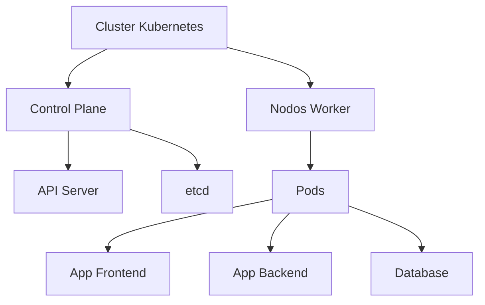

## **Clase de Kubernetes desde lo básico hasta avanzado, estructurado en módulos**

### **Módulo 1: Introducción a Kubernetes**

**Objetivo:** Entender los conceptos fundamentales y la arquitectura de Kubernetes.

1. **¿Qué es Kubernetes?**

   - Orquestador de contenedores para automatizar despliegues, escalado y gestión.
   - Ventajas: Alta disponibilidad, escalabilidad, auto-reparación.

2. **Arquitectura de Kubernetes**

- **Cluster**: Conjunto de nodos (máquinas físicas/virtuales).
  - **Nodo Master (Control Plane)**:
    - **kube-apiserver**: Punto de entrada para gestionar el cluster.
    - **etcd**: Base de datos clave-valor para almacenar estados del cluster.
    - **kube-scheduler**: Asigna Pods a nodos.
    - **kube-controller-manager**: Gestiona controladores (ej: ReplicaSet).
  - **Nodos Worker**:
    - **kubelet**: Agente que ejecuta Pods.
    - **kube-proxy**: Gestiona reglas de red.
- **Pod**: Unidad mínima (1 o más contenedores compartiendo red/almacenamiento).
- **Deployment**: Gestiona el ciclo de vida de aplicaciones (despliegues, actualizaciones).
- **Service**: Expone aplicaciones internas/externamente.

---

### **Módulo 2: Instalación y Configuración**

**Objetivo:** Configurar un cluster local y aprender comandos básicos.

1. **Herramientas para Desarrollo Local**

- **Minikube**: Cluster local de un solo nodo.

```bash
minikube start --driver=docker
```

- **kubectl**: CLI para interactuar con clusters.

```bash
kubectl cluster-info
```

1. **Comandos Básicos**

- Ver recursos:

```bash
kubectl get pods,svc,deployments
```

- Describir un recurso:

```bash
kubectl describe pod <nombre-pod>
```

---

### **Módulo 3: Despliegues Básicos**

**Objetivo:** Crear aplicaciones simples en Kubernetes.

1. **Crear un Pod**

- Ejemplo de YAML (`pod.yaml`):

```yaml
apiVersion: v1
kind: Pod
metadata:
  name: nginx-pod
spec:
  containers:
  - name: nginx
    image: nginx:latest
    ports:
    - containerPort: 80
```

- Aplicar:

```bash
kubectl apply -f pod.yaml
```

2. **Desplegar una Aplicación con Deployment**

- Ejemplo (`deployment.yaml`):

```yaml
apiVersion: apps/v1
kind: Deployment
metadata:
  name: nginx-deployment
spec:
  replicas: 3
  selector:
    matchLabels:
      app: nginx
  template:
    metadata:
      labels:
        app: nginx
    spec:
      containers:
      - name: nginx
        image: nginx:latest
```

- Escalar réplicas:

```bash
kubectl scale deployment nginx-deployment --replicas=5
```

3. **Exponer la Aplicación con un Service**

- Tipo ClusterIP (interno):

```bash
kubectl expose deployment nginx-deployment --port=80
```

- Tipo NodePort (acceso externo):

```bash
kubectl expose deployment nginx-deployment --type=NodePort --port=80
```

---

### **Módulo 4: Escalado y Auto-reparación**

**Objetivo:** Aprender a gestionar la disponibilidad de aplicaciones.

1. **ReplicaSets**

- Asegura que un número específico de Pods estén en ejecución.
- Ejemplo de YAML (similar a Deployment, pero sin estrategias de actualización).

2. **Liveness y Readiness Probes**

- **Liveness**: Verifica si el contenedor está en buen estado.

```yaml
livenessProbe:
  httpGet:
    path: /health
    port: 8080
  initialDelaySeconds: 5
  periodSeconds: 10
```

- **Readiness**: Determina si el contenedor está listo para recibir tráfico.

---

### **Módulo 5: Gestión de Configuración y Secrets**

**Objetivo:** Gestionar configuraciones y datos sensibles.

1. **ConfigMaps**

- Almacena configuraciones no sensibles.
- Ejemplo:

```bash
kubectl create configmap app-config --from-literal=DB_HOST=mysql
```

- Usar en un Pod:

```yaml
env:
  - name: DB_HOST
    valueFrom:
      configMapKeyRef:
        name: app-config
        key: DB_HOST
```

1. **Secrets**

- Almacena datos sensibles (codificados en base64).

- Ejemplo:

```bash
kubectl create secret generic db-secret --from-literal=password=1234
```

- Usar en un Pod:

```yaml
env:
  - name: DB_PASSWORD
    valueFrom:
      secretKeyRef:
        name: db-secret
        key: password
```

---

### **Módulo 6: Almacenamiento Persistente**

**Objetivo:** Gestionar volúmenes para datos persistentes.

1. **PersistentVolumes (PV) y PersistentVolumeClaims (PVC)**

- **PV**: Recurso de almacenamiento en el cluster.
- **PVC**: Solicitud de almacenamiento por un Pod.
- Ejemplo de PVC (`pvc.yaml`):

```yaml
apiVersion: v1
kind: PersistentVolumeClaim
metadata:
  name: my-pvc
spec:
  accessModes:
    - ReadWriteOnce
  resources:
    requests:
      storage: 1Gi
```

2. **Montar un PVC en un Pod**

```yaml
volumes:
  - name: data-volume
    persistentVolumeClaim:
      claimName: my-pvc
```

---

### **Módulo 7: Networking Avanzado**

**Objetivo:** Entender cómo funciona la red en Kubernetes.

1. **Servicios Avanzados**

- **LoadBalancer**: Expone la aplicación usando un balanceador de carga cloud (ej: AWS ELB).
- **Ingress**: Gestiona tráfico HTTP/HTTPS con reglas de enrutamiento.
- Ejemplo con Nginx Ingress:

```bash
kubectl apply -f https://raw.githubusercontent.com/kubernetes/ingress-nginx/main/deploy/static/provider/cloud/deploy.yaml
```

2. **Network Policies**

- Define reglas de comunicación entre Pods.
- Ejemplo:

```yaml
apiVersion: networking.k8s.io/v1
kind: NetworkPolicy
metadata:
  name: allow-frontend
spec:
  podSelector:
    matchLabels:
      role: frontend
  ingress:
    - from:
      - podSelector:
          matchLabels:
            role: backend
```

---

### **Módulo 8: Seguridad**

**Objetivo:** Asegurar el cluster y las aplicaciones.

1. **ServiceAccounts y RBAC**

- **ServiceAccount**: Identidad para procesos en Pods.
- **Role-Based Access Control (RBAC)**: Define permisos.
- Ejemplo de Role:

```yaml
apiVersion: rbac.authorization.k8s.io/v1
kind: Role
metadata:
  name: pod-reader
rules:
  - apiGroups: [""]
    resources: ["pods"]
    verbs: ["get", "list"]
```

2. **SecurityContext**

- Restringe permisos en contenedores:

```yaml
securityContext:
  runAsUser: 1000
  capabilities:
    drop: ["ALL"]
```

---

### **Módulo 9: Operaciones Avanzadas**

**Objetivo:** Automatizar tareas complejas.

1. **Operadores (Operators)**

- Extienden Kubernetes para gestionar aplicaciones stateful (ej: bases de datos).
- Ejemplo: Operador de Prometheus.

2. **Helm**: Gestor de paquetes para Kubernetes.

- Instalar Helm:

```bash
curl https://raw.githubusercontent.com/helm/helm/main/scripts/get-helm-3 | bash
```

- Instalar un chart:
```bash
helm install my-mysql bitnami/mysql
```

---

### **Módulo 10: Monitoreo y Logging**

**Objetivo:** Supervisar el cluster y aplicaciones.  

1. **Prometheus y Grafana**

- Instalación detallada con Helm:

```bash
helm repo add prometheus-community https://prometheus-community.github.io/helm-charts
helm install prometheus prometheus-community/prometheus \
  --namespace monitoring --create-namespace
```

- Acceder a Grafana:

```bash
kubectl port-forward svc/prometheus-grafana 3000:80 -n monitoring
# Usuario: admin, Contraseña: prom-operator
```  

2. **EFK Stack (Elasticsearch, Fluentd, Kibana)**

- Despliegue paso a paso:

```bash
# Instalar Elasticsearch
kubectl apply -f https://download.elastic.co/downloads/eck/2.6.1/crds.yaml
kubectl apply -f https://download.elastic.co/downloads/eck/2.6.1/operator.yaml

# Configurar Fluentd como DaemonSet
kubectl apply -f https://raw.githubusercontent.com/fluent/fluentd-kubernetes-daemonset/master/fluentd-daemonset-elasticsearch.yaml
```  

---

### **Proyecto Final**

**Descripción:** Desplegar una aplicación de microservicios (frontend + backend + base de datos) con:

- Despliegues en diferentes namespaces (`frontend`, `backend`, `db`)  
- Configuración centralizada con ConfigMaps/Secrets  
- Almacenamiento persistente para PostgreSQL  
- Exposición pública mediante Ingress  
- Monitoreo integrado  

**Pasos:**  

1. **Crear namespaces:**

```bash
kubectl create namespace frontend
kubectl create namespace backend
kubectl create namespace db
```  

2. **Base de datos (PostgreSQL con Persistent Volume):**

```yaml
# postgres.yaml (namespace: db)
apiVersion: v1
kind: PersistentVolumeClaim
metadata:
  name: postgres-pvc
  namespace: db
spec:
  accessModes: [ReadWriteOnce]
  resources:
    requests:
      storage: 5Gi
---
apiVersion: apps/v1
kind: Deployment
metadata:
  name: postgres
  namespace: db
spec:
  replicas: 1
  template:
    spec:
      containers:
      - name: postgres
        image: postgres:15
        envFrom:
        - secretRef:
            name: db-secret
```  

3. **Backend (API en Python):**

```yaml
# backend/configmap.yaml (namespace: backend)
apiVersion: v1
kind: ConfigMap
metadata:
  name: backend-config
data:
  API_ENV: "production"
```  

4. **Frontend (React con Ingress):**

```yaml
# frontend/ingress.yaml
apiVersion: networking.k8s.io/v1
kind: Ingress
metadata:
  name: frontend-ingress
  annotations:
    nginx.ingress.kubernetes.io/rewrite-target: /
spec:
  rules:
  - http:
      paths:
      - path: /
        pathType: Prefix
        backend:
          service:
            name: frontend-service
            port:
              number: 80
```  

5. **Conectar componentes:**

```bash
# Exponer servicios entre namespaces
kubectl expose deployment postgres --type=ClusterIP --port=5432 -n db
kubectl expose deployment backend --type=ClusterIP --port=8000 -n backend
```  

**Verificación:**

```bash
# Verificar todos los componentes
kubectl get pods,svc,ingress --all-namespaces

# Acceder a la aplicación
curl http://<IP-del-cluster>
```  

**Limpiar recursos:**

```bash
kubectl delete namespaces frontend backend db
```  

---

## **Conclusión y Próximos Pasos**

**Hemos cubierto:**

- Arquitectura básica de Kubernetes  
- Despliegues escalables con Deployments/ReplicaSets  
- Gestión de configuración y secrets  
- Networking avanzado con Ingress  
- Seguridad con RBAC y SecurityContext  
- Monitoreo profesional con Prometheus  

**Para profundizar:**

1. **Kubernetes Certifications:**
  
   - CKAD (Certified Kubernetes Application Developer)  
   - CKA (Certified Kubernetes Administrator)  

3. **Proveedores Cloud:**

   ```bash
   # Ejemplo en AWS EKS
   eksctl create cluster --name mi-cluster --region us-east-1
   ```  

4. **GitOps con ArgoCD:**

   ```bash
   kubectl create namespace argocd
   kubectl apply -n argocd -f https://raw.githubusercontent.com/argoproj/argo-cd/stable/manifests/install.yaml
   ```  


