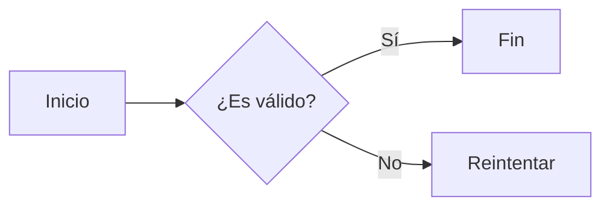
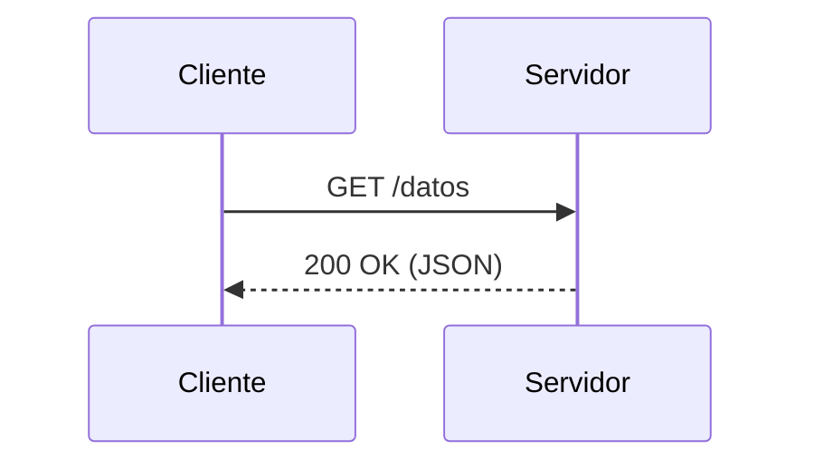
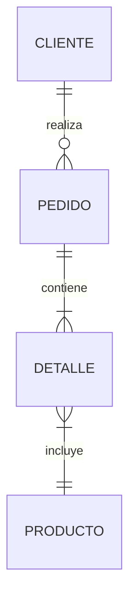
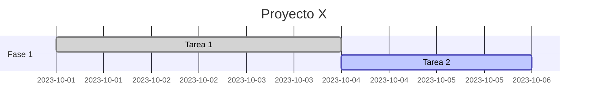

## **Mermaid para Diagramas Textuales**

### **1. Introducción a Mermaid**

**Objetivo:** Comprender qué es Mermaid y sus ventajas.

- **¿Qué es Mermaid?**

  - Librería JavaScript de código abierto para generar diagramas a partir de texto.  
  - Soporta diagramas como:  
    - Flowcharts (diagramas de flujo).  
    - Sequence diagrams (diagramas de secuencia).  
    - Class diagrams (diagramas de clases).  
    - Gantt charts (diagramas de Gantt).  
    - Entity-Relationship Diagrams (ERD).  
    - Y más (mind maps, journey maps, etc.).  
  
  - **Ventajas:**

    - Integrable con Markdown, Git, y herramientas de documentación.  
    - Fácil de versionar (texto plano).  
    - No requiere herramientas gráficas externas.  

- **Comparación con otras herramientas**

  - PlantUML: Similar, pero Mermaid es más fácil de integrar en entornos web.

  - Draw.io / Lucidchart: Herramientas visuales vs. enfoque textual.  

---

### **2. Instalación y Configuración**

**Objetivo:** Aprender a usar Mermaid en distintos entornos.

- **En navegador (CDN):**

  ```html
  <script src="https://cdn.jsdelivr.net/npm/mermaid@10.0.0/dist/mermaid.min.js"></script>
  <script>mermaid.initialize({ startOnLoad: true });</script>
  ```

- **En Markdown (GitHub/GitLab):**

  Usar bloques de código con etiqueta `mermaid`:  

````markdown
  ```mermaid
  flowchart LR
    A --> B
  ```
  ````
  
- **Via npm:**

  ```bash
  npm install mermaid
  ```

---

### **3. Sintaxis Básica (Flowcharts)**

**Objetivo:** Crear diagramas de flujo simples.

- **Ejemplo Básico:**



- **Reglas:**
  - `flowchart LR`: Define dirección (Left-to-Right).  
  - Nodos: `A[Texto]` (cuadrado), `B{Texto}` (rombo).  
  - Flechas: `-->` (línea sólida), `-.->` (línea punteada).  

---

### **4. Diagramas de Secuencia**

**Objetivo:** Modelar interacciones entre componentes.

- **Ejemplo:**



- **Reglas:**
  - `participant` define actores.  
  - `->>` para flechas sólidas, `-->>` para punteadas.  

---

### **5. Reglas y Errores Comunes**

- **Sintaxis Clave:**
  - Indentación correcta para estructuras anidadas (ej: en Gantt charts).  
  - Evitar caracteres no permitidos en nodos (usar comillas si hay espacios: `A["Texto largo"]`).

- **Errores Frecuentes:**
  - Olvidar definir participantes antes de usarlos en sequence diagrams.  
  - Dirección no válida en flowcharts (ej: `TB` en vez de `LR`).  

---

### **6. Casos de Uso**

- **Documentación Técnica:**
  - Explicar arquitecturas con diagramas de clases o flujos de trabajo.

- **Planificación de Proyectos:**

  Diagramas de Gantt para cronogramas.

- **Diseño de Sistemas:**

  Diagramas de secuencia para APIs.  

---

### **7. Recursos y Herramientas**  

- **Documentación Oficial:**
 [mermaid-js.github.io](https://mermaid-js.github.io/)

- **Editores Online:**

  - [Mermaid Live Editor](https://mermaid.live/)  
  - [StackEdit](https://stackedit.io/) (Markdown + Mermaid).

- **Integraciones:**

  - VS Code: Extensión *Markdown Preview Mermaid Support*.  
  - Obsidian: Plugin oficial.  

---

### **8. Ejercicio Práctico**

**Crear un ERD (Entity-Relationship Diagram):**



- **Resultado Esperado:**  
Diagrama con entidades y relaciones (uno a muchos, etc.).  

---

### **9. Mejores Prácticas**

- **Mantenerlo Simple:** Evitar nodos excesivos.

- **Comentarios:** Usar `%%` para comentarios internos.


- **Estilos Personalizados:**

  Usar clases CSS para colores o formas.  

---

### **10. Preguntas Frecuentes**

- **¿Cómo depurar errores?**

Usar el Live Editor para validar sintaxis.

- **¿Se puede exportar a PNG/PDF?**

Sí, con herramientas como [mermaid-cli](https://github.com/mermaid-js/mermaid-cli).  

---

**Evaluación Final:**

- Crear un diagrama de Gantt con tareas y dependencias.

- Solución:



**¡Listo para diagramar sin salir de tu editor de texto!** 🧜‍♀️📊
