## **Tutorial de Mermaid para Diagramas Textuales**

### **1. Introducción a Mermaid**

**Objetivo:** Comprender qué es Mermaid y sus ventajas.

#### **¿Qué es Mermaid?**

- Librería JavaScript de código abierto que genera diagramas a partir de texto plano
- Permite crear diagramas como:
  - Diagramas de flujo (Flowcharts)
  - Diagramas de secuencia (Sequence diagrams)
  - Diagramas de clases (Class diagrams)
  - Diagramas de Gantt (Gantt charts)
  - Diagramas Entidad-Relación (ERD)
  - Diagrama de estado (State diagrams)
  - Mapas mentales (Mind maps)
  - Diagramas de usuario (User Journey)
  - Y más tipos en continua evolución

#### **Ventajas:**

- **Integración:** Compatible con Markdown, GitHub, GitLab, Notion y muchas herramientas de documentación
- **Control de versiones:** Al ser texto plano, es fácil de versionar en sistemas como Git
- **Simplicidad:** No requiere herramientas gráficas externas o software especializado
- **Mantenimiento:** Los diagramas evolucionan con la documentación técnica

#### **Comparación con otras herramientas**

- **PlantUML:** Similar en enfoque, pero Mermaid tiene mejor integración web y sintaxis más intuitiva
- **Draw.io / Lucidchart:** Herramientas visuales WYSIWYG vs. enfoque textual de Mermaid
- **Graphviz:** Más potente pero con curva de aprendizaje más pronunciada

### **2. Instalación y Configuración**

**Objetivo:** Aprender a usar Mermaid en distintos entornos.

#### **En navegador (CDN actualizado):**

```html
<script src="https://cdn.jsdelivr.net/npm/mermaid/dist/mermaid.min.js"></script>
<script>
  mermaid.initialize({ 
    startOnLoad: true,
    theme: 'default' // También disponibles: 'dark', 'forest', 'neutral'
  });
</script>
```

### **En Markdown (GitHub/GitLab/Notion):**

````markdown
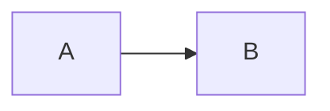
````

### **Via npm:**

```bash
npm install mermaid
```

### **Uso con JavaScript:**

```javascript
import mermaid from 'mermaid';

mermaid.initialize({ startOnLoad: true });
// Para renderizar dinámicamente
mermaid.render('mermaid-container', 'graph TD\nA-->B');
```

## **3. Sintaxis Básica (Flowcharts)**

**Objetivo:** Crear diagramas de flujo simples.

### **Ejemplo Básico:**

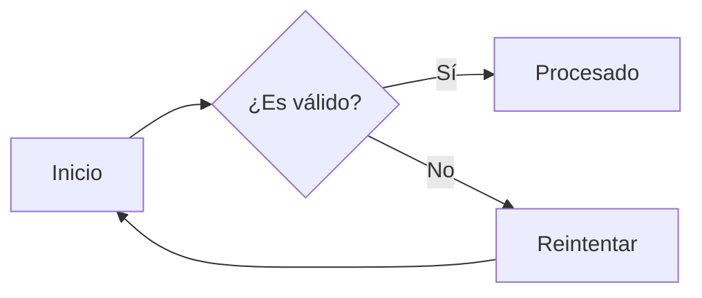

### **Direcciones:**

- `TB` - Top to Bottom
- `TD` - Top Down (igual que TB)
- `BT` - Bottom to Top
- `RL` - Right to Left
- `LR` - Left to Right

### **Nodos:**

- Rectángulo: `A[Texto]`
- Rectángulo redondeado: `A(Texto)`
- Estadio: `A([Texto])`
- Subrutina: `A[[Texto]]`
- Cilindro: `A[(Texto)]`
- Círculo: `A((Texto))`
- Rombo: `A{Texto}`
- Hexágono: `A{{Texto}}`
- Paralelogramo: `A[/Texto/]`
- Trapezoide: `A[\Texto\]`

### **Conexiones:**

- Línea con flecha: `A --> B`
- Línea punteada: `A -.-> B`
- Línea gruesa: `A ==> B`
- Línea sin flecha: `A --- B`
- Texto en línea: `A -->|texto| B`
- Línea con longitud: `A ---> B`

## **4. Diagramas de Secuencia**

**Objetivo:** Modelar interacciones entre componentes.

### **Ejemplo:**

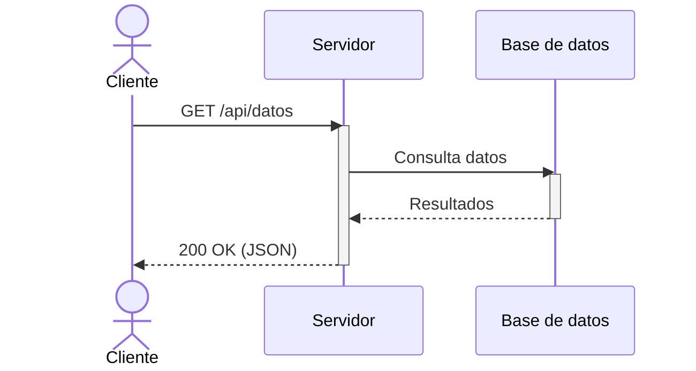

### **Elementos clave:**

- `actor`: Representa usuarios o roles externos
- `participant`: Define sistemas o componentes
- `activate/deactivate`: Muestra período de actividad
- `->>`: Flecha sólida (solicitud)
- `-->>`: Flecha punteada (respuesta)
- `note over/right of/left of`: Añade notas explicativas

## **5. Diagramas de Clase**

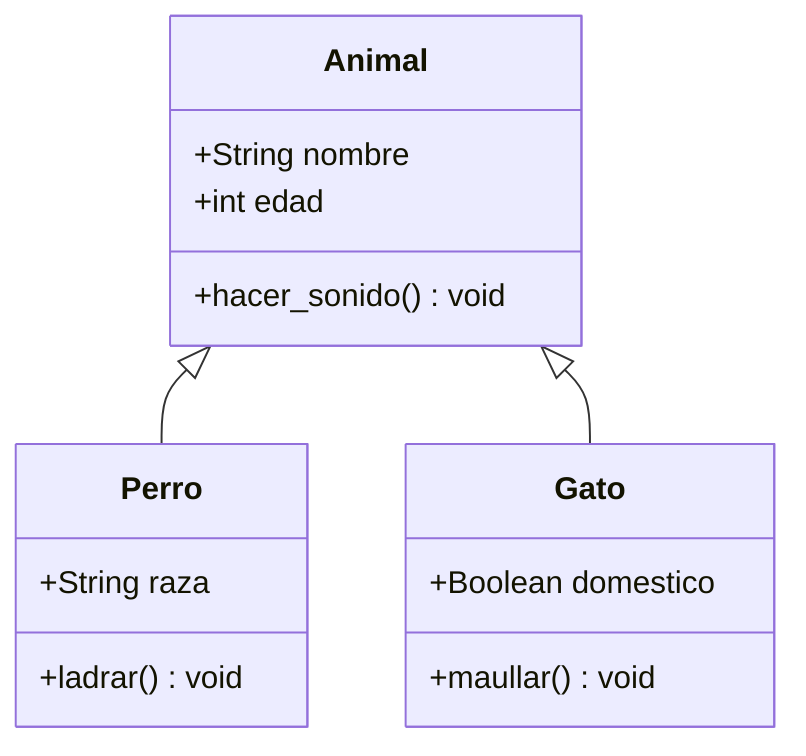

### **Relaciones:**

- Herencia: `<|--`
- Composición: `*--`
- Agregación: `o--`
- Asociación: `-->`
- Dependencia: `..>`
- Realización: `<|..`

## **6. Diagramas de Estado**

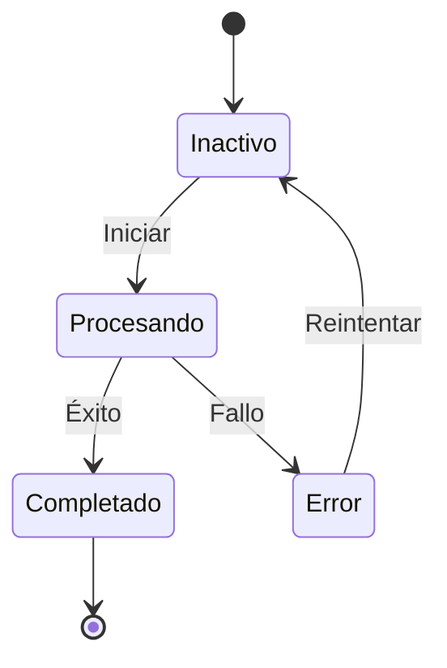

## **7. Diagramas de Gantt**

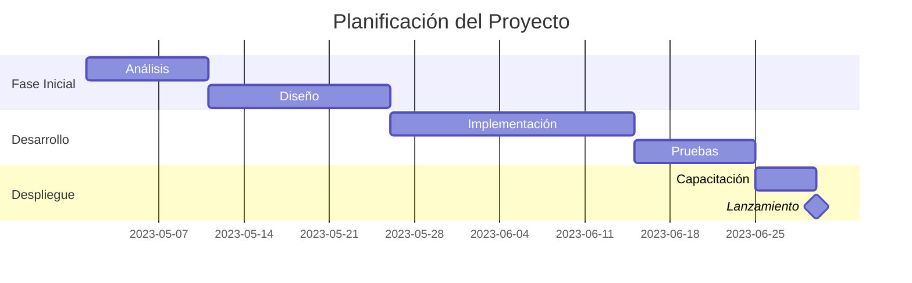

## **8. Diagramas de Entidad-Relación**

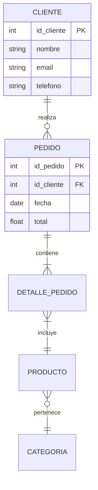

## **9. Pie Charts (Gráficos Circulares)**

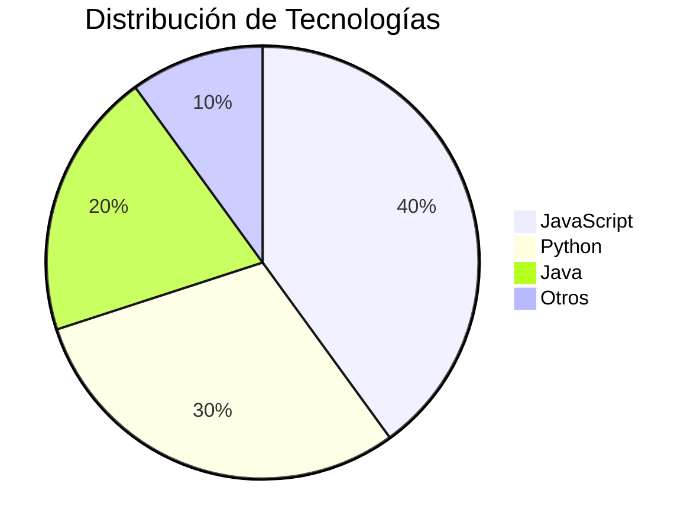

## **10. Mejores Prácticas**

### **Mantener la simplicidad:**

- Evitar diagramas demasiado complejos (máximo 15-20 nodos)
- Dividir diagramas grandes en múltiples más pequeños
- Usar subgráficos para agrupar elementos relacionados

### **Organización:**

- Usar comentarios para documentar secciones complejas:

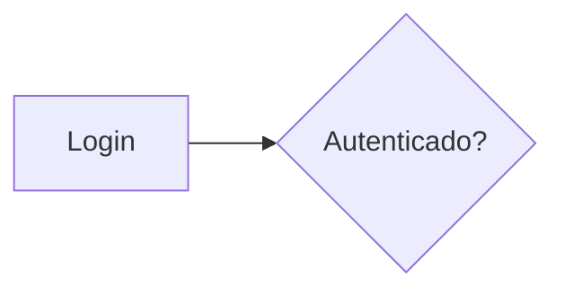

### **Estilos personalizados:**

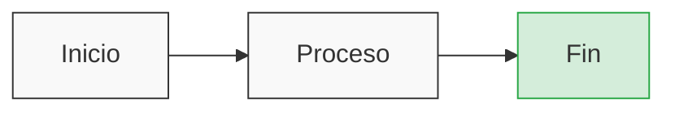

## **11. Depuración y Solución de Problemas**

### **Validación de sintaxis:**

- Usar [Mermaid Live Editor](https://mermaid.live/) para verificar diagramas
- Activar el modo debug en la inicialización:

```javascript
mermaid.initialize({
  startOnLoad: true,
  securityLevel: 'loose',
  logLevel: 1 // Para depuración
});
```

### **Errores comunes:**

- Olvidar definir la dirección en flowcharts (`LR`, `TD`, etc.)
- Usar caracteres especiales sin escapar en nodos
- Indentación incorrecta en diagramas complejos

## **12. Herramientas y Recursos**

### **Editores y visores:**

- [Mermaid Live Editor](https://mermaid.live/) - Editor online con vista previa instantánea
- [Markdown Preview Mermaid Support](https://marketplace.visualstudio.com/items?itemName=bierner.markdown-mermaid) - Extensión para VS Code
- [Obsidian Mermaid Plugin](https://help.obsidian.md/Plugins/Mermaid) - Para usuarios de Obsidian

### **Documentación oficial:**

- [Documentación de Mermaid](https://mermaid.js.org/intro/)
- [GitHub de Mermaid](https://github.com/mermaid-js/mermaid)

### **Exportación:**

- Usar mermaid-cli para generar PNG/PDF:

```bash
npm install -g @mermaid-js/mermaid-cli
mmdc -i input.mmd -o output.png
```

## **13. Ejercicio Práctico**

**Objetivo:** Crear un diagrama de flujo para un proceso de pedido online

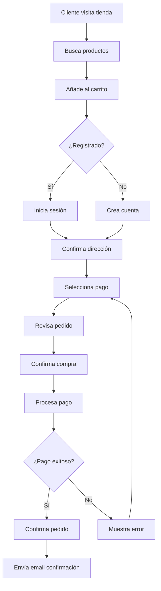

---

**Recuerda:** La sintaxis de Mermaid evoluciona constantemente. Si encuentras problemas, consulta la [documentación oficial](https://mermaid.js.org/intro/) para las últimas actualizaciones.

¡Feliz diagramación! 🧜‍♀️📊